#
Level 1

These are all the challenges for Level One.

## Table of Contents

* [Challenge One](#challenge-one)
* [Challenge Two](#challenge-two)
* [Challenge Three](#challenge-three)
* [Challenge Four](#challenge-four)
* [Challenge Five](#challenge-five)
* [Challenge Six](#challenge-six)
* [Challenge Seven](#challenge-seven)
* [Challenge Eight](#challenge-eight)
* [Challenge Nine](#challenge-nine)
* [Challenge Ten](#challenge-ten)
* [Challenge Eleven](#challenge-eleven)
* [Challenge Twelve](#challenge-twelve)

## Challenge One

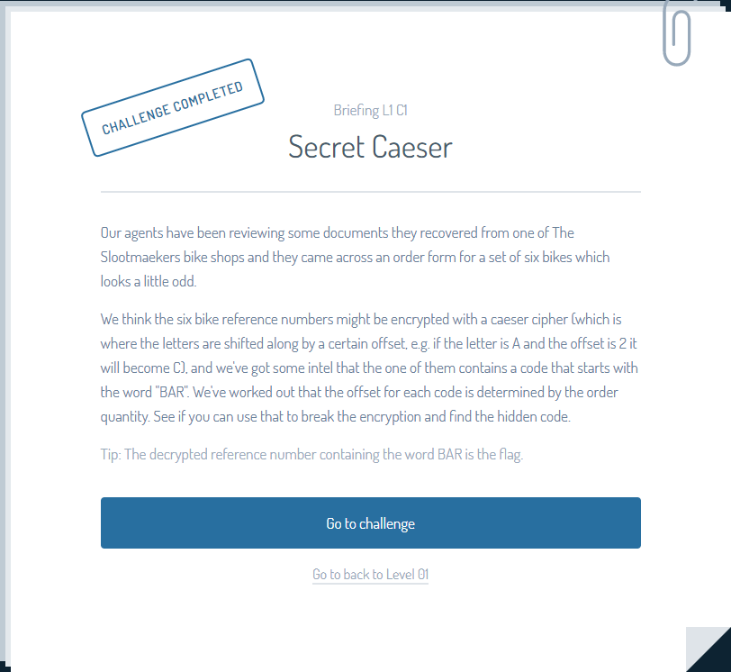

### Initial Thoughts

Looking through the briefing, we see that we need to decrypt a 'caesar cipher'. Simple enough. This is one of the most common and easy encryption methods out there, so it makes sense that the first challenge would be something like this.

### What actually happened

Diving into the challenge, we are greeted with this.

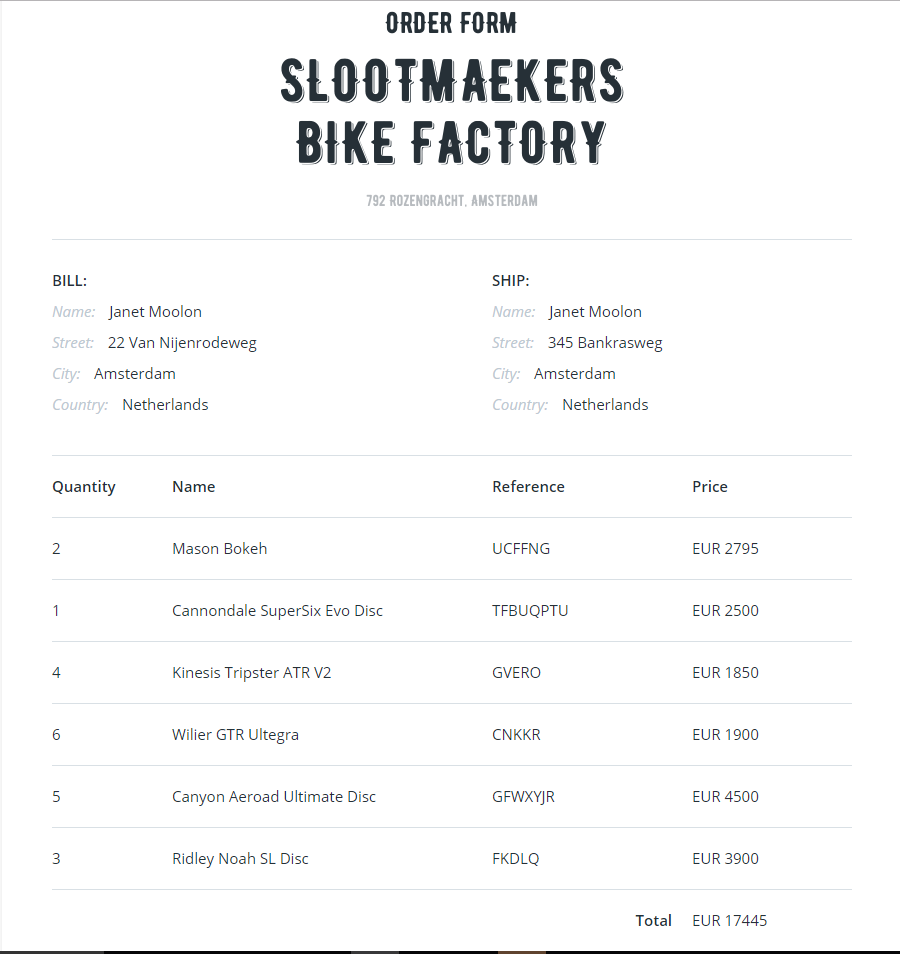

If you recall from the initial briefing, our job is to take all the columns's reference numbers and decode them and see which one starts with BAR.

From here on out its just a matter of copy and pasting the numbers into one of the many online \(or you can do it yourself if you want\) Caesar Cipher decoder websites and seeing which one starts with BAR. Once you do that you can see that the row with the reference number 'GFWXYJR' translates to 'BARSTEM'. This is the row we want.

### Final Thoughts

Knowing the Caesar Cipher encryption method is good since many easy/beginner level Capture the Flags use it to ease you in to the competition, as time goes on you will be able to recognize the patterns and recognize certain encryption schemes by heart.

## Challenge Two

### Initial Thoughts

Looking through the briefing, we can see that we are tasked with finding out someone's age in order to pose as that person to log in to their account. Finding out someone's information with malicious intent \(such as posing as them in order to gain more information\), commonly known as 'Doxing', is very common in many online communities and is one of the reasons as to why you should keep your information secret.

### What actually happened

Looking at the page, we see what looks to be a typical login screen with the username and favorite color fields filled in. This fits what was told to us in the briefing, that we already have two pieces of information, his username and his favorite color, and that we just need to find out his age.

Taking a closer look at the username field, we see that the person's username is lars\_1986. We can guess from the number part of his name, 1986, that this person was born in 1986. Since we know the year he was born, we can figure out his age from some simple subtraction \(2017 - 1986 = 31 years old\). This is why that your username's shouldn't contain any private information, since leaving information in your username can lead to others finding other things about you that you never intended to reveal.

### Final Thoughts

All in all, this was a pretty simple challenge. We found out the person's age by realizing that the year in the person's username was his date of birth, and we were able to submit details and log in as that individual.

## Challenge Three

### Initial Thoughts

### What actually happened

Reading through the briefing, we see that we need to find out which email is fake, and click the part of the email that lets you know that it is fake.

Looking at the emails, we can see that each email has two parts. The header, which contains the sender and receiver of the email, and the body, which contains the message of the email.

Reading through all of the email bodies, everything seems normal. Nothing stands out as being too shady, so we know that the part that reveals the email as fake must be in an email header somewhere.

Reading through all of the headers closely, we find this.

Everything about this email header looks normal except for the fact that natwestt.com has two t's in it, Uh Oh. The sender tried to trick us into believing that they were an organization that has a similar name. We click on this part of the email, and receive our flag.

### Final Thoughts

This challenge displays the potential dangers of not checking who an email is coming from. If this person had not checked that the sender was not the organization they thought it was, they could have had their banking information stolen and lost a significant amount of money. You should always double check when sending sensitive information online that the person you are sending it to is the person you think it is.

## Challenge Four

### Initial Thoughts

### What actually happened

Looking at the email, we see a list of customers next to a bunch of seemingly random numbers.
We got a hint from the briefing that none of the numbers went over 26, which hints towards a simple A1Z26 cipher, in which each letter is represented by its numerical order in the alphabet. A = 1, B = 2,.. Z = 26.

Knowing this, we can just use any [online tool](http://rumkin.com/tools/cipher/numbers.php) to solve this cipher.

Pasting in the numbers into the solver, we can see that the secret is 'WHEEL'. This is our flag.

### Final Thoughts

From the email, we recognized the type of encoding used to hide the secret message, and were able to decode it using a random internet tool. Story of my life.

## Challenge Five

### Initial Thoughts

### What actually happened

Looking at the website, we see what looks to be a flier for a Canal Race. In the briefing, they hinted towards there being some hidden text somewhere on the page. The best way to find hidden items on a webpage is to open up the developer tools, so lets do just that.

If you are using Google Chrome, you can either
- Select the Chrome menu Chrome Menu at the top-right of your browser window, then select Tools > Developer Tools.
- Right-click on any page element and select Inspect Element.

After opening your developer tools, the page should look something like this.

If you are on a different tab, you should switch over to the `elements` tab. This tab contains information about all the elements on the page, and is the perfect tab for finding hidden items on webpages.

Using your arrow keys, you can navigate through all the elements on the webpage. As you can see in this picture, I have selected the logo of the page in the developer tools, and on the actual webpage this item is highlighted.

Wait, what's that? Looking closer at this picture, we see that there is a div on the page containing the text "Go to /secret.html".
`
Go to /secret.html
`

This must be the hidden text we were looking for, since this text isn't visible anywhere on the page!

Navigating to /secret.html through their built in web browser, we get our flag.

### Final Thoughts
If you are looking for hidden items on a webpage, it is imperative that you look through the elements on the page through your browser's developer tools. Staring at the page itself will only get you so far, since the developer of the website could use either styling or code to hide items on the page.

## Challenge Six

### Initial Thoughts
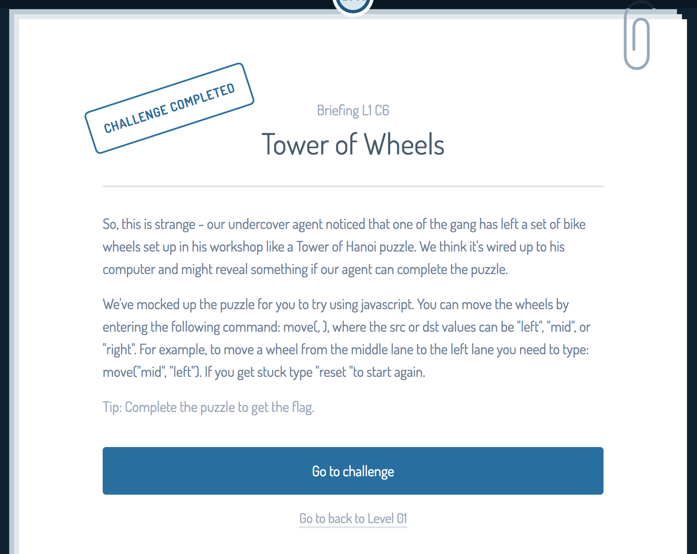

### What actually happened
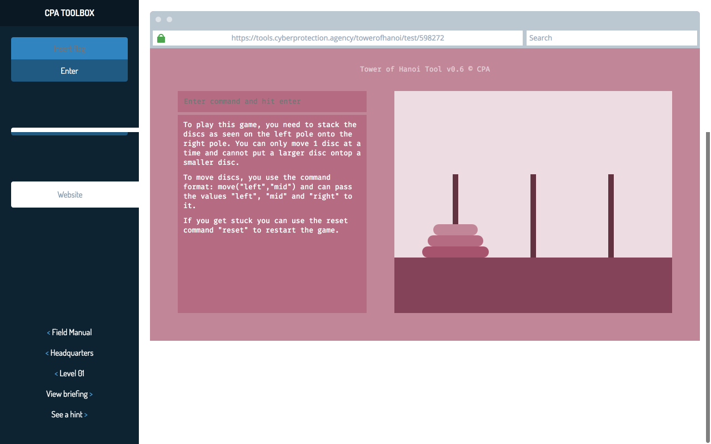
Going into the challenge, we see a Tower of Hanoi game set up for us. In the top left, we can put in commands to move the discs (`move("left", "mid")`, `move("right", "left")`, ..etc). This moves the disc from the first argument (left, right, mid), to the second argument (left, right, mid). It seems all we have to do here is win the game (move all the discs from the left pole to the right pole), and it will give us the flag.

Yep!

### Final Thoughts
This challenge just tested if you knew how to correctly invoke functions, as well as basic problem solving. Pay no attention to the mistake in commands I did in the screenshot please.

## Challenge Seven

### Initial Thoughts

It looks like we are going to have to decode some ASCII encoded text into a readable format.

### What actually happened
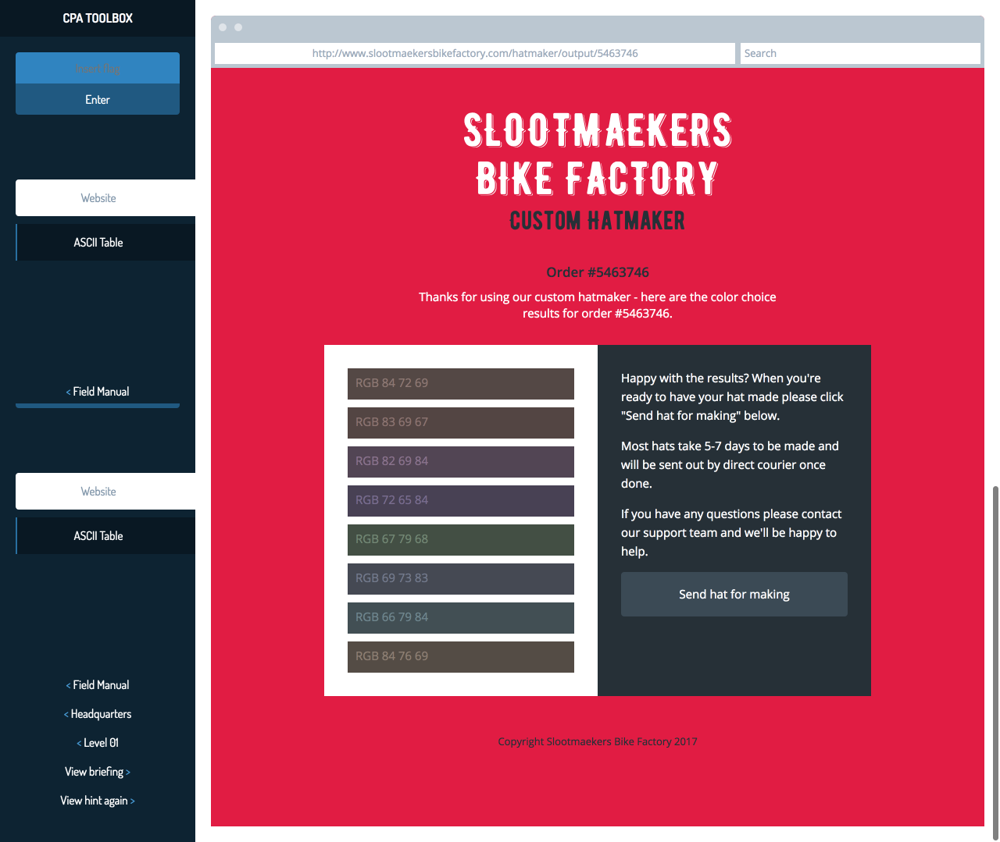
Looking at the challenge, we see an order form. On the left side of the page, we see a bunch of RGB colors. The briefing (and the fact that we are provided an ASCII Table), both hint towards converting ASCII into text. All we have to do now is found any [online tool](https://convert.town/ascii-to-text) and put in those values to get the secret.

From this we can see that the secret hat code is 'BOTTLE'. This is our flag.

### Final Thoughts
This, like many of the other challenges on level one was pretty easy. All we had to do was find a tool that suited our needs in order to complete the challenge. Of course, we could have done all that conversion manually through the provided ASCII table, but wheres the fun in that?

## Challenge Eight

### Initial Thoughts

We are going to have to decode some message, and our flag is the two colors put together.

### What actually happened
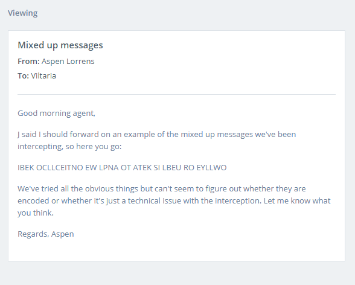
Reading through the email, we can see a bunch of mixed up words. Reading through the text, your brain might have corrected the message to 'BIKE COLLECTION WE PLAN TO TAKE IS BLUE OR YELLOW'. If not, all you have to do is look at each word individually and figure out what it might be. Or you could use some tool like [this](https://scrabblewordfinder.org/).

### Final Thoughts
Are the challenges getting easier? Or am I getting smarter :insert dinosaur thinking meme:

## Challenge Nine

### Initial Thoughts

The briefing tells us that we are going to have to fix an image inside if the source code, easy enough.. right?

### What actually happened
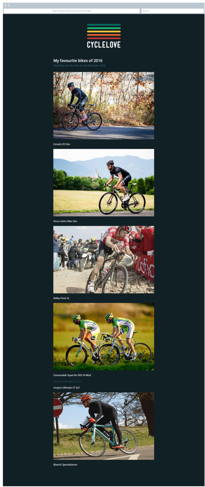

Uh oh, looks like the image for the 'Cannondale SuperSix EVO Hi-Mod' bike is broken! Time to save the day boys. Time to open up the developer tools and get to work.

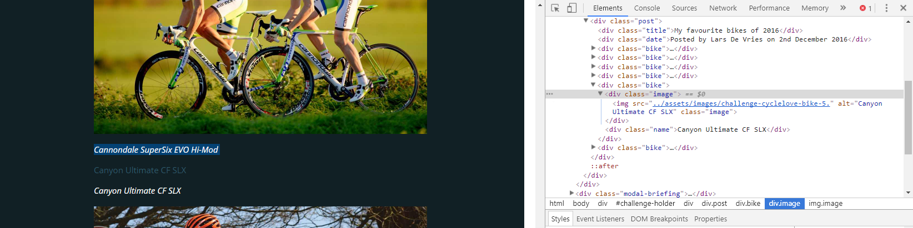

Aha! looking at the `src` property of the `img` tag, we see that the image link is missing a file extension! Lets fix that by adding a .jpg at the end, we can edit the image link by double clicking on the text. (We know it's a jpg since the other images had this file extension, so why shouldn't this one?)

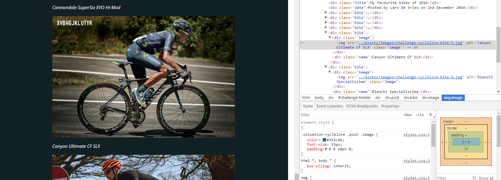

It worked! When we added the correct file extension to the image, the image showed up on the page with our flag! Super Rad!

### Final Thoughts
Knowing your way around the browser's developer tools is very helpful in finding out what a webpage is really doing and/or whats wrong with it in this case. A good read for beginners might be [this](http://davidsutoyo.com/2015/03/18/using-chrome-developer-tools-for-htmlcss-part-1/).

## Challenge Ten

### Initial Thoughts

It looks like we are going to have to look through a bunch of files and find out which one we can execute, seems easy enough.

### What actually happened
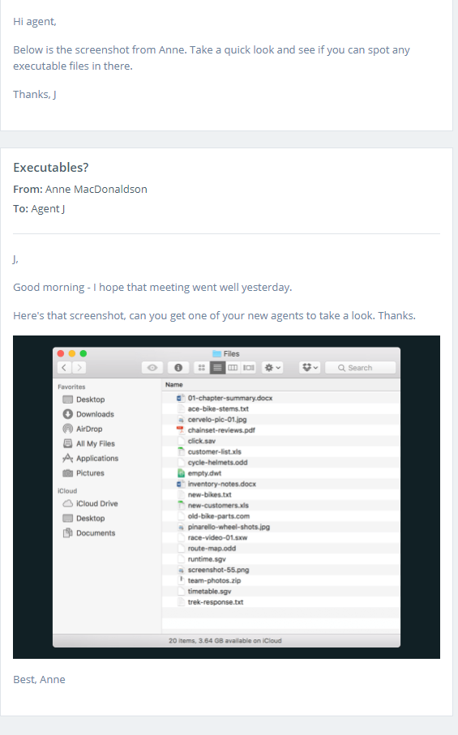
Holy crap. That's a lot of file extensions.

Now we could do research on all those file extensions, but that require effort, some thing I don't have. First, I try the edgy looking file extensions like the .com... wait. I got it. First try. Wow I'm good.

### Final Thoughts
Looking at all of the file extensions, we can recognize some of the more common ones like the .jpg and the .pdf, but for other file extensions, we have to either look them up or guess based on their icon. [Here](https://en.wikipedia.org/wiki/List_of_file_formats) is a list of file extensions if you ever get bored.

## Challenge Eleven

### Initial Thoughts

We are going to have to find the report for the first user. Here we go.

### What actually happened
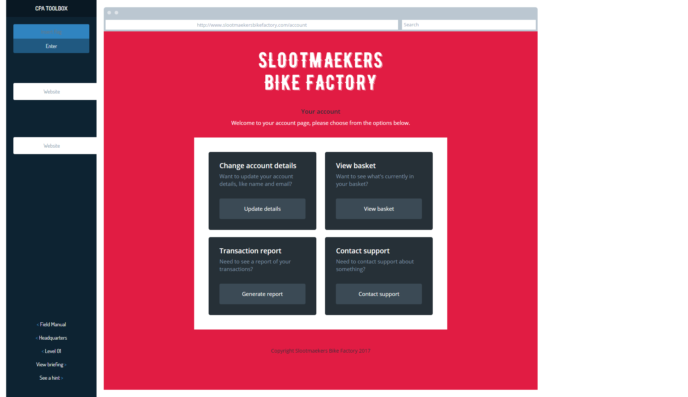

Okay, seeing as we have to find the report for the first user, I say we try generating a report for ourselves just to see how the system works.

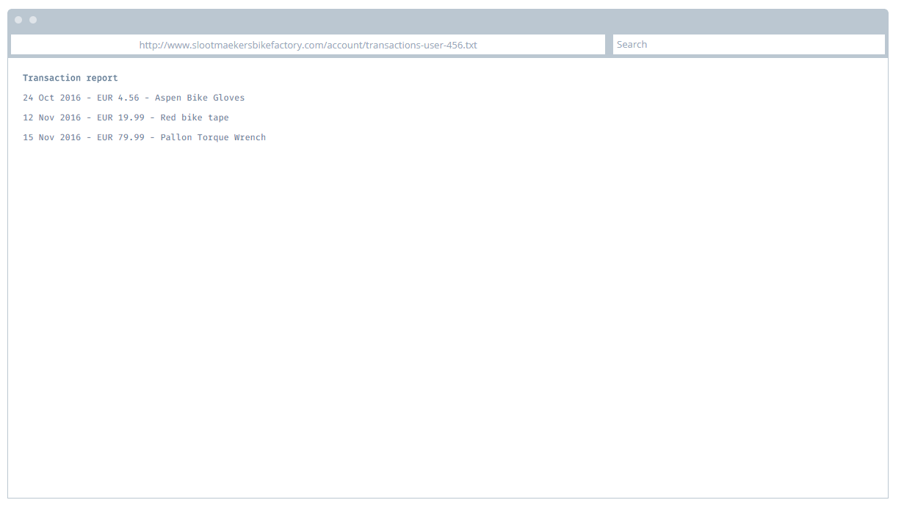

Okay, looks pretty norm- Wait a second. What's that url? `http://www.slootmaekersbikefactory.com/account/transactions-user-`**456**`.txt`

Does that mean we are the 456th user? Let's try putting 1 there instead and see what happens.

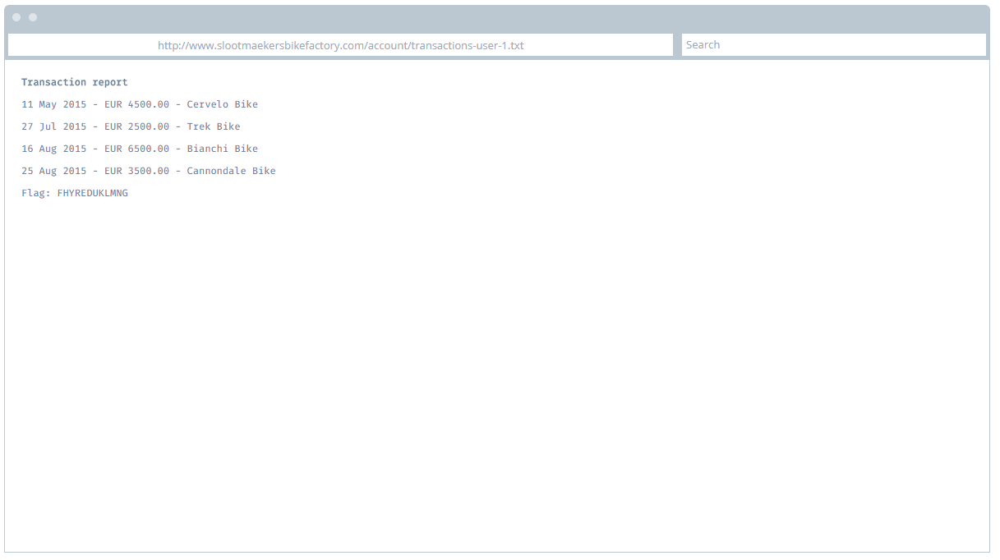

Yep! It appears the site was generating a text file with the number of the account as the target designation.

### Final Thoughts
Wow, these slootmaekers are really terrible at building safe web applications. Sensitive information should always be put behind some authentication method.

## Challenge Twelve

### Initial Thoughts
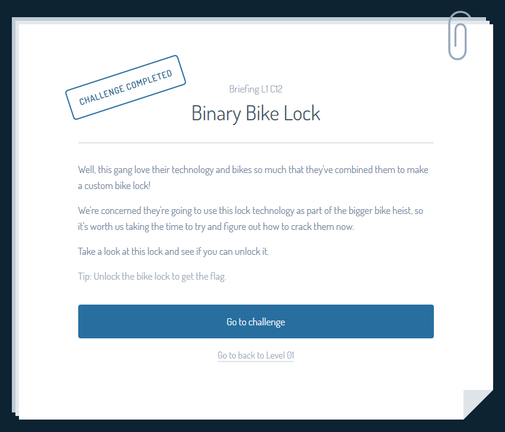

### What actually happened
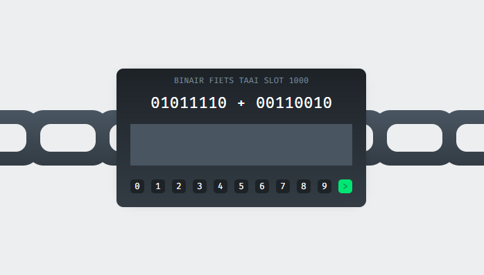

It looks like this "lock" is just a binary calculator. Let's find [one online](http://www.calculator.net/binary-calculator.html) and plug these bad boys in.

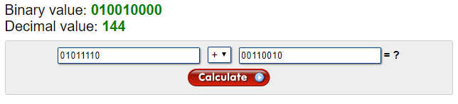

144 huh? Let's try that.

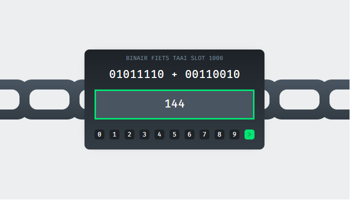

Success!

### Final Thoughts
What a terrible lock.

## Ending Thoughts
All in all, most of these challenges were pretty simple. The first few challenges or in this case the first level usually serves as an warm-up for the next levels. I hope you had a better time reading this than I did writing it. Thanks for reading!
